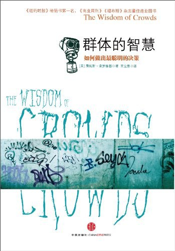

##  书名

《群体的智慧：如何做出最聪明的决策》

英文原名：《The Wisdom of Crowds: Why the Many Are Smarter Than the Few & How Collective Wisdom Shapes Business,Economies, Societies & Nations》

## 封面

## 内容简介

《纽约客》杂志著名的专栏作家詹姆斯•索罗维基却认为我们要么是低估了群体的智慧，要么是高估了精英或者专家们的作用。例如，在搜寻美国沉没的核潜艇“天蝎号”时，缺少信息的大众做出的方位预测精确度超过了军事专家；美国的艾奥瓦电子市场更是准确预测出了施瓦辛格当选州长；好莱坞证券交易所也依靠群体的智慧预测电影的票房收入。

这是一个群体智慧的时代，信息业和传媒业的发展让彼此之间的距离变得不再遥远。只要掌握了激发群体智慧的原则，我们就能在这纷繁的世界自如地生活着。群体的智慧能让著名时装生产商zara始终把握潮流，能让股票投资趋于理性。当然，群体的智慧也能告诉你：为什么会塞车？为什么一家受到顾客青睐的酒店不会人满为患？有什么好方法让你赢得竞猜节目的大奖？

## 作者简介

詹姆斯•索罗维基（James Surowiecki），《纽约客》杂志特约撰稿人。他的文章见诸很多出版物，包括《纽约时报》《华尔街日报》《艺术论坛报》《连线》杂志和《候选人名单》杂志。索罗维基最初在《纽约客》杂志的“金融专版”阐述了群体智慧的思想，回答了美国社会长期以来对群体智慧和团队决策能力的质疑。

## 推荐理由

想要理解开源共同体的决策，就需要理解人类社会是如何做出决策的，Linux 项目也好，其它的群体也好，是可行的。但是，作为读者，我们需要了解的是有没有什么条件。

## 推荐人

[适兕](https://opensourceway.community/all_about_kuosi)，作者，「开源之道」主创。「OSCAR·开源之书·共读」发起者和记录者。