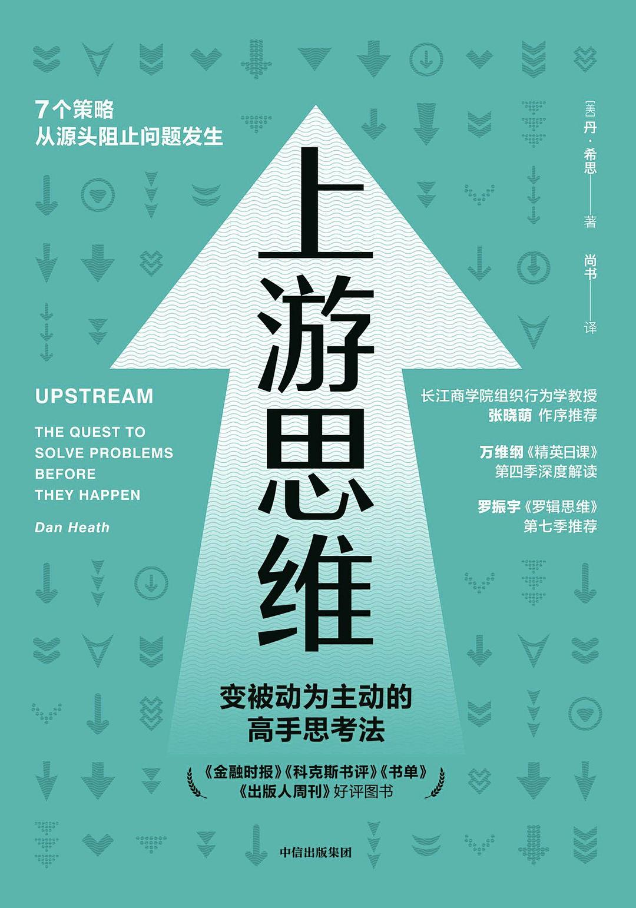

##  书名

《上游思维 : 在问题发生前解決的根治之道》

英文原名：《Upstream: The Quest to Solve Problems Before They Happen》

## 封面

## 内容简介

上游思维是一种防患于未然的思维。与之相对的是下游，在下游解决问题，我们只能被动反应，治标不治本。

作者丹·希思提出，大部分人都处于下游区域，疲于应对一个又一个问题却无力摆脱。我们太过专注于眼下，却忘了逆流而上，去上游寻找问题的精准干预点。

书中列举了上游行动的成功和失败案例，揭示了三大思维陷阱和七大成功策略。

三大思维陷阱：无视问题、缺乏责任心和隧道视野；

七大成功策略：团结合适的人、改变系统、找到抓手、设置问题预警、谨防假成功、避免二次伤害、找到买单的人。

## 作者简介

丹·希思（Dan Heath）是《纽约时报》《华尔街日报》畅销书作家，曾任哈佛商学院研究员，现任杜克大学高级研究员。创新媒体教育公司思睿（Thinkwell）创办人之一。和哥哥奇普·希思合著过“行为设计学”系列四本书：《打造峰值体验》《零成本改变》《让创意更有黏性》《掌控关键决策》。希思兄弟的书在世界范围内已售出300多万册，并被翻译成33种语言。

## 推荐理由

在拥抱开源的过程中，上游思维是重要的观念，如果不能掌握上游思考模式，则就会被一时的贪婪所蒙蔽，欠下技术债务，本来拥抱开源的优势却成了创新的绊脚石。Upstream first ！ 否则不如远离开源。

## 推荐人

[适兕](https://opensourceway.community/all_about_kuosi)，作者，「开源之道」主创。「OSCAR·开源之书·共读」发起者和记录者。