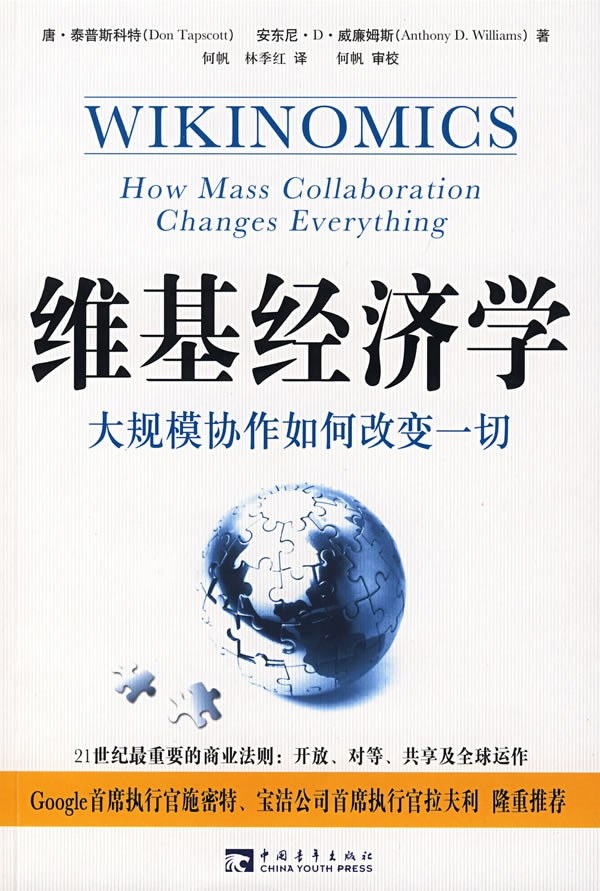

##  书名

《维基经济学：大规模协作如何改变一切》

英文原名：《Wikinomics:How Mass Collaboration Changes Everything》

## 封面

## 内容简介

维基经济学的得名，缘于维基百科全书网站的巨大成功，它向世界证明：如果有一种方法充分利用组织里每一个人的智慧，它的能量将无比惊人！维基经济学所揭示的四个新法则——开放、对等、共享以及全球运作——正在取代一些旧的商业教条，许多成熟的传统公司正在从这种新的商务范式中受益。我们所熟知的企业如Google、亚马逊、宝洁、IBM、乐高、英特尔、宝马、波音、百思买、Youtube、MySpace等，都已经从维基经济中获得巨大的成功。

## 作者简介

唐·泰普斯科特：全球著名的新经济学家和商业策略大师，被誉为“数字经济之父”。他于1992年创办了新范式（New Paradigm）智库，研究突破性技术在生产率、商业效能、竞争力等方面的商业应用。他也是世界最受追捧的商业演讲人之一，《财富》500强企业中超过半数的CEO们，曾聆听过他的演讲。其中包括许多重要人物，如美国前总统克林顿、IBM总裁郭士纳、微软前总裁鲍尔默、Google公司CEO施密特等等。他的著作包括畅销书《数字经济蓝图》、《数字化成长》等。

## 推荐理由

维基百科是个奇迹，除了供我们日常查阅资料、学习知识之外，它是如何形成的？难道不值得所有对开源和协作好奇的人们着迷吗？

## 推荐人

[适兕](https://opensourceway.community/all_about_kuosi)，作者，「开源之道」主创。「OSCAR·开源之书·共读」发起者和记录者。