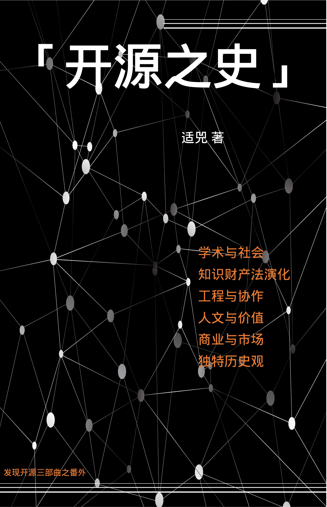

##  书名

《开源之史》

## 封面

## 内容简介

这是一部「开源之道」的思考之作，也是一部尝试用经济、社会、技术、法律等诸多视角去阐述开源过去几十年的诞生、发展、曲折的历程，尝试用历史的角度去挖掘开源背后的逻辑。

作者并不是一个用简单逻辑去诠释复杂的开源的莽撞少年，而是历经多年的边缘人身份，去亲历、去体验、去沟通、去实践，然后才去撰写这部开源的历史的，尤其拒绝采用时间线的方式去诠释开源的历程。

在线阅读地址：https://opensourceway.community/posts/history-of-open-source/summary/

扫码阅读：

## 作者简介

「发现开源三部曲」（[《开源之迷》](https://opensourceway.community/posts/book-of-open-source/the-fascinating-of-open-source/)，《开源之道》《开源之思》。）、[《开源之史》](https://opensourceway.community/posts/history-of-open-source/summary/)作者，「开源之道：致力于开源相关思想、知识和价值的探究、推动」主创，开放原子开源基金会资深顾问，Linux基金会亚太区开源布道者（2022/2023年度团队主席）， 云计算开源产业联盟OSCAR（中国信息通信研究院发起)个人开源专家，OSPO Group 联合发起人。

## 推荐理由

想要了解一个不同于自身环境的文化，一定要去了解这个文化的过去，经历了什么～ 《开源之史》并没有局限在某个具体的技术发展，也没有聚焦在某个项目，而是尝试嵌入经济、社会、法律、技术史等视角，呈现给读者一个更加接近真实的开源。

