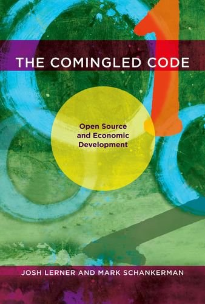

##  书名

《混杂代码：开源及其经济发展》

英文原名：《The Comingled Code： open source and Economic development》

## 封面

## 内容简介

关于开放源码软件的经济影响的讨论往往是热度大于光度。支持者热情洋溢地宣称开源软件的好处，而批评者则抨击其影响。在这场争论中，缺少的是关于开源软件对消费者、企业和整体经济发展影响的严谨经济分析和系统经济证据。本书填补了这一空白。在《混杂的代码》一书中，乔希-勒纳（Josh Lerner）和马克-申克曼（Mark Schankerman）利用一个新的大型数据库，表明开源软件和专有软件有时会以意想不到的方式相互作用，并讨论了这些发现对政策的影响。新数据（来自一系列处于不同发展阶段的国家）记录了开源软件和专有软件的混合：公司在销售专有软件的同时为开源软件做出贡献，而用户则广泛地混合和搭配这两种软件。Lerner 和 Schankerman 研究了软件在促进经济发展方面与其他技术的不同之处，个人和企业为开源项目做出贡献的动机，开发者和用户如何看待两种软件之间的权衡，以及政府政策如何确保开源软件与专有软件有效竞争并促进经济发展。

## 作者简介

Josh Lerner 是哈佛商学院雅各布-H.希夫（Jacob H. Schiff）教授，哈佛商学院投资银行教授，同时兼任金融和创业部门的职务。他著有《破碎梦想大道》（The Boulevard of Broken Dreams）一书：为什么促进创业和风险投资的公共努力失败了，正确的方式该怎么办？

Mark Schankerman 是伦敦经济学院经济学教授、经济绩效中心副研究员和伦敦经济政策研究中心研究员。

## 推荐理由

从经济学的视角去看软件的生产和消费，最能满足大众的需求者胜出，或者说能以最少成本做更多事的方式胜出，那么开源和专有是互补的，专有可以赚钱，但是对开发者竖起来高墙；开源保持着高生产力，但是在定价方面却激活了人类的优点：“搭便车”，于是我们看到的是一个开源和专有混合的软件产业，共同为我们人类大众服务。没有人可以左右所有人的选择。

 -- By <a href="https://opensourceway.community/">适兕</a>  作者,「开源之道」主创，「OSCAR·开源之书·共读」发起者和记录者

